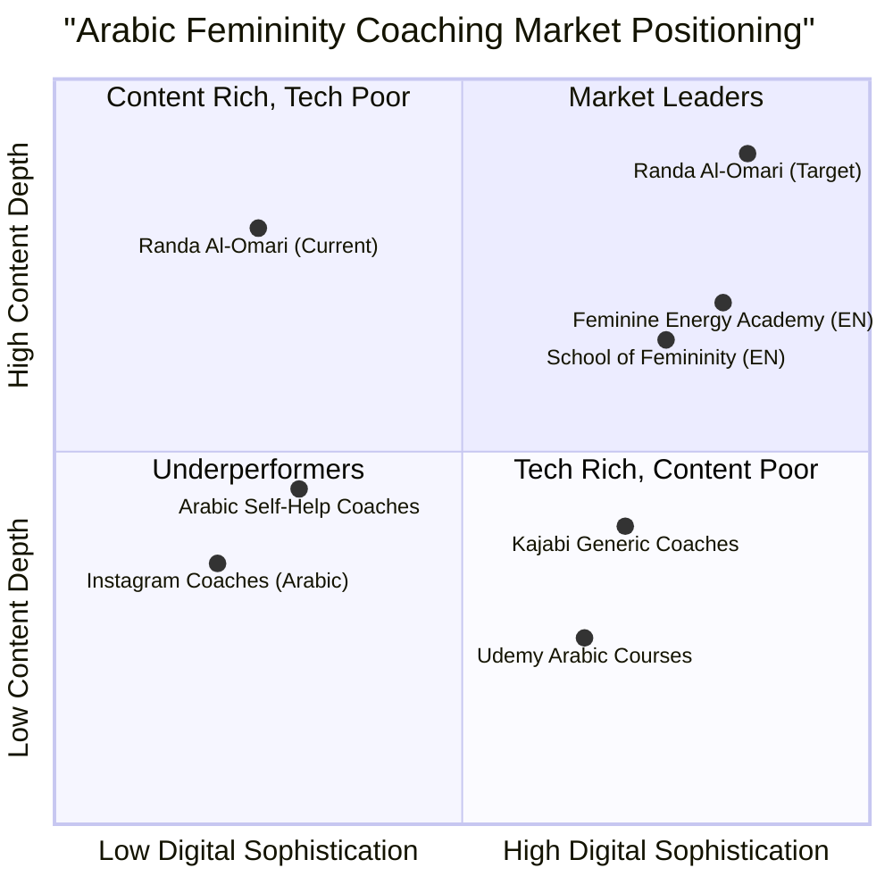

# Feminine Queens Awakening — Platform Strategy & Product Requirements Document

**Document Type:** Product Strategy & PRD  
**Prepared by:** Emma (Product Manager)  
**Date:** April 2026  
**Client:** Coach Randa Al-Omari — Feminine Queens Awakening  
**Version:** 1.0  

---

## TABLE OF CONTENTS

1. [Executive Summary](#1-executive-summary)
2. [Project Overview & Goals](#2-project-overview--goals)
3. [Target Audience Personas & Emotional Triggers](#3-target-audience-personas--emotional-triggers)
4. [Full User Journey Mapping](#4-full-user-journey-mapping)
5. [Platform Goals & Success Metrics](#5-platform-goals--success-metrics)
6. [Complete Website Structure Diagram](#6-complete-website-structure-diagram)
7. [Page-by-Page Specifications](#7-page-by-page-specifications)
8. [User Flows](#8-user-flows)
9. [Dashboard Structure](#9-dashboard-structure)
10. [Sales Funnel System](#10-sales-funnel-system)
11. [Monetization Strategy](#11-monetization-strategy)
12. [UX Improvements Over Current System](#12-ux-improvements-over-current-system)
13. [Competitive Analysis](#13-competitive-analysis)
14. [Requirements Pool](#14-requirements-pool)
15. [Open Questions](#15-open-questions)

---

## 1. EXECUTIVE SUMMARY

### 1.1 Current State Assessment

The Feminine Queens Awakening platform, led by Coach Randa Al-Omari, currently operates as **7 disconnected subdomains** with no unified navigation, inconsistent checkout experiences, zero email capture infrastructure, no user accounts, and no cross-selling mechanisms. Despite strong content, compelling brand voice, and a well-structured pricing ladder ($25–$15,000), the platform is severely underperforming its revenue potential due to structural, UX, and conversion architecture deficiencies.

### 1.2 Strategic Vision

This document defines the complete product strategy for a **unified digital platform** that consolidates all offerings under one cohesive experience, implements proper sales funnels, introduces a user dashboard with course delivery, and creates a scalable monetization engine — transforming a fragmented collection of landing pages into a professional digital coaching business.

### 1.3 Key Transformation Metrics

| Dimension | Current State | Target State |
|-----------|--------------|--------------|
| Platform Architecture | 7 disconnected subdomains | 1 unified platform |
| Navigation | None between pages | Global persistent nav with RTL support |
| User Accounts | Non-existent | Full dashboard + progress tracking + community |
| Checkout Systems | Mixed (WhatsApp/Stripe/External) | Unified checkout with multiple payment options |
| Lead Capture | Zero email capture points | 10+ lead magnet touchpoints |
| Cross-selling | None | Automated recommendation engine + upsell flows |
| Content Hub | Non-existent | Blog + Video library + Free resources |
| Mobile Experience | Inconsistent | Responsive-first RTL design system |
| Estimated Conversion Rate | 1–2% | 5–8% (target) |
| Estimated Annual Revenue Potential | Unknown (fragmented) | $897,000+ |

### 1.4 Product Definition

- **Language:** Arabic (primary), English (secondary consideration)
- **Programming Language:** Shadcn-ui, TypeScript, Tailwind CSS
- **Project Name:** `feminine_queens_platform`
- **Backend Service:** Atoms Cloud

### 1.5 Original Requirements (Restated)

Redesign the complete Feminine Queens Awakening digital platform by performing deep analysis of all 7 existing URLs, extracting all offerings/user flows/gaps, analyzing conversion friction and monetization opportunities, defining personas and user journeys, and designing a complete platform architecture including public website, courses LMS, user dashboard, sales funnels, content hub, and community layer — delivered as a professional website strategy proposal.

---

## 2. PROJECT OVERVIEW & GOALS

### 2.1 Product Goals

1. **Unify & Professionalize the Brand Experience:** Consolidate 7 fragmented subdomains into a single, cohesive, RTL-optimized platform that reflects the premium positioning of the Feminine Queens Awakening brand and builds immediate authority and trust.

2. **Maximize Conversion & Revenue:** Implement direct checkout on all products, transparent pricing, payment plans, automated email funnels, and cross-selling infrastructure to increase conversion rates from an estimated 1–2% to 5–8% and unlock $897K+ annual revenue potential.

3. **Enable Scalable Growth Without Manual Bottlenecks:** Replace WhatsApp-dependent sales processes with automated lead capture, nurture sequences, self-service checkout, and a full LMS dashboard — allowing Coach Randa to scale beyond personal bandwidth limitations.

### 2.2 User Stories

| # | User Story | Priority |
|---|-----------|----------|
| US-1 | As a **new visitor from Instagram**, I want to immediately understand what Feminine Queens Awakening offers and find the right program for me, so that I don't feel overwhelmed by disconnected pages. | P0 |
| US-2 | As a **woman exploring femininity coaching**, I want to take a personalized quiz that recommends the right program based on my situation and budget, so that I feel guided rather than sold to. | P0 |
| US-3 | As a **potential buyer**, I want to see transparent pricing with payment plan options and checkout directly on the website, so that I don't have to message on WhatsApp and wait for a response. | P0 |
| US-4 | As an **enrolled student**, I want a personal dashboard where I can access my courses, track my progress, download resources, and see what's next in my transformation journey, so that I stay engaged and motivated. | P0 |
| US-5 | As a **course graduate**, I want to be recommended the next level program and have access to a community of like-minded women, so that my transformation continues beyond a single course. | P1 |

---

## 3. TARGET AUDIENCE PERSONAS & EMOTIONAL TRIGGERS

### 3.1 Persona Profiles

#### Persona 1: "Seeking Sara" — The Explorer

| Attribute | Detail |
|-----------|--------|
| **Age** | 25–35 |
| **Relationship Status** | Single or in early relationship |
| **Core Pain** | Feels disconnected from her femininity; struggles with self-worth and attracting healthy relationships |
| **Primary Goal** | Understand femininity and attract a healthy, loving relationship |
| **Budget Range** | $100–$600 |
| **Ideal Entry Point** | Book → Femininity & Emotional Relationships Course ($555) |
| **Digital Behavior** | Active on Instagram, watches YouTube self-help content, consumes short-form video |
| **Decision Style** | Needs social proof and free value before committing; price-sensitive but willing to invest if trust is built |
| **Language** | Arabic (Gulf/Levantine dialect preference) |

**Emotional Triggers:**
- Fear of being alone or unworthy of love
- Desire to feel beautiful, confident, and feminine
- Comparison with women who seem to "have it all"
- Hope that understanding femininity will unlock relationship success

---

#### Persona 2: "Healing Hana" — The Wounded

| Attribute | Detail |
|-----------|--------|
| **Age** | 30–45 |
| **Relationship Status** | Married (struggling) or divorced |
| **Core Pain** | Carries deep mother/father wounds that sabotage relationships; repeating generational patterns |
| **Primary Goal** | Heal childhood trauma and transform current relationship dynamics |
| **Budget Range** | $500–$2,000 |
| **Ideal Entry Point** | Mother Wound Healing Course → Royal Feminine Love Course ($1,111) |
| **Digital Behavior** | Searches for healing content, follows coaches and therapists, reads long-form content |
| **Decision Style** | Emotionally driven; needs to feel understood and safe before purchasing; values depth over polish |
| **Language** | Arabic |

**Emotional Triggers:**
- Pain from the past that keeps resurfacing in present relationships
- Desperate desire to break generational patterns for herself and her children
- Guilt about not being "enough" as a wife/mother/woman
- Longing for inner peace and emotional freedom

---

#### Persona 3: "Transforming Tala" — The Committed

| Attribute | Detail |
|-----------|--------|
| **Age** | 30–50 |
| **Relationship Status** | Married, possibly struggling or in crisis |
| **Core Pain** | Lost herself in marriage/motherhood; wants deep, holistic transformation |
| **Primary Goal** | Complete feminine awakening and relationship transformation |
| **Budget Range** | $2,000–$7,000 |
| **Ideal Entry Point** | 6-Month Community Program ($6,800) |
| **Digital Behavior** | Watches long-form content, attends webinars, values community and group support |
| **Decision Style** | Ready to invest significantly but needs a structured application process and personal connection (clarity call) |
| **Language** | Arabic |

**Emotional Triggers:**
- Desperation for change after years of feeling stuck
- Ready to invest in herself for the first time
- Desire for sisterhood and belonging with women on the same journey
- Fear of what happens if she doesn't change now

---

#### Persona 4: "Royal Reem" — The Premium Client

| Attribute | Detail |
|-----------|--------|
| **Age** | 35–55 |
| **Relationship Status** | High-income, values privacy and exclusivity |
| **Core Pain** | Needs private, confidential transformation work; may have public profile or social standing |
| **Primary Goal** | Deep personal coaching with expert guidance, tailored to her specific situation |
| **Budget Range** | $10,000–$20,000 |
| **Ideal Entry Point** | 1-on-1 Royal Journey ($15,000) |
| **Digital Behavior** | Selective content consumption; values referrals and personal recommendations |
| **Decision Style** | Expects premium experience from first touchpoint; needs detailed case studies and personal connection before committing |
| **Language** | Arabic (possibly bilingual Arabic/English) |

**Emotional Triggers:**
- Desire for exclusivity and personal attention from the coach
- Need for confidentiality and discretion
- Willingness to pay premium for guaranteed results and VIP treatment
- Status alignment — "Royal" language resonates deeply

---

### 3.2 Comprehensive Emotional Triggers Map

This map is **critical** for this niche. Every touchpoint must activate the right emotional trigger for the right persona at the right stage.

| Emotional Trigger | Activation Method | Where to Deploy | Target Persona |
|-------------------|------------------|-----------------|----------------|
| **Self-worth & Deserving Love** | Mirror questions: "Do you feel worthy of the love you desire?" | Homepage hero, quiz, email sequences, social ads | Sara, Hana |
| **Fear of Repeating Patterns** | Generational trauma messaging: "Your mother's pain doesn't have to be yours" | Mother Wound page, blog content, email nurture | Hana |
| **Desire for Feminine Power** | Aspirational imagery, queen/royal language, transformation stories | All sales pages, social media, brand identity | All |
| **Loneliness & Disconnection** | Community belonging: "Join 500+ women on this journey" | Community program page, membership pitch, dashboard | Tala |
| **Urgency to Transform** | Limited cohort spots, countdown timers, "Your future self is waiting" | Sales pages, email campaigns, webinar pitch | Tala, Reem |
| **Transformation Proof** | Before/after testimonials with specific emotional outcomes | Every product page, testimonials hub, email sequences | All |
| **Safety & Trust** | Coach vulnerability, personal story, credentials, guarantee | About page, VSL, blog, welcome email sequence | All |
| **Exclusivity & Royal Identity** | "Royal" language, VIP positioning, private access | Premium offerings, 1-on-1 page, application process | Reem |
| **Maternal Guilt** | "Heal yourself to heal your children" messaging | Mother Wound page, blog, email sequences | Hana |
| **Hope & Possibility** | Student success stories showing specific transformations | Testimonials page, post-purchase emails, social proof | All |

### 3.3 Persona-to-Product Mapping

```
Sara (Explorer)          Hana (Wounded)           Tala (Committed)         Reem (Premium)
     |                        |                        |                        |
     v                        v                        v                        v
  Book ($25)           Mother Wound ($777)      Community ($6,800)      1-on-1 ($15,000)
     |                        |                        |                        
     v                        v                        v                        
  Course ($555)        Royal Feminine ($1,111)   Royal Journey ($15K)    
     |                        |                                                 
     v                        v                                                 
  Royal Feminine ($1,111)  Community ($6,800)                                   
     |                        |                                                 
     v                        v                                                 
  Community ($6,800)    Royal Journey ($15K)                                    
```

---

## 4. FULL USER JOURNEY MAPPING

### 4.1 Five-Stage Journey Framework

The user journey is designed around 5 stages: **Awareness → Trust → Engagement → Purchase → Retention**. Each stage has specific touchpoints, content types, emotional triggers, and conversion goals.

---

#### Stage 1: AWARENESS — "I Didn't Know I Needed This"

| Element | Detail |
|---------|--------|
| **Channels** | Instagram Reels, YouTube videos, TikTok, Pinterest, Google Search (SEO) |
| **Content Types** | Short emotional clips (60–90s), transformation tips, relatable pain point content, SEO blog articles |
| **Emotional Triggers Activated** | Self-worth questioning, fear of patterns, desire for change |
| **Primary Goal** | Drive traffic to website (homepage, blog, or quiz) |
| **KPIs** | Website visits, social engagement rate, click-through rate from bio |
| **Touchpoints** | Social media posts → Bio link → Homepage OR Blog post (via SEO) |

**Key Design Decision:** Replace the current Linktree-style links page with a **branded homepage** that immediately communicates value, builds trust, and guides visitors to the right next step.

---

#### Stage 2: TRUST — "Can She Really Help Me?"

| Element | Detail |
|---------|--------|
| **Channels** | Website (homepage, about, blog, testimonials), email welcome sequence |
| **Content Types** | Coach Randa's personal story, student transformation stories, educational blog posts, free resources, VSL video |
| **Emotional Triggers Activated** | Safety, vulnerability, proof of transformation, expertise |
| **Primary Goal** | Email capture and initial trust building |
| **KPIs** | Email subscribers, quiz completions, time on site, pages per session |
| **Touchpoints** | Homepage → About page / Quiz / Free resource download → Email capture |

**Critical Insight:** The current platform has **zero email capture points**. This stage is entirely missing, meaning 90%+ of interested visitors are lost forever. The redesigned platform must capture emails at every meaningful touchpoint.

---

#### Stage 3: ENGAGEMENT — "I'm Starting to Believe This Could Work for Me"

| Element | Detail |
|---------|--------|
| **Channels** | Email sequences, free mini-course, webinar, book, blog content |
| **Content Types** | 5-email welcome sequence, free 3-lesson mini-course, live masterclass/webinar, book chapters, deeper educational content |
| **Emotional Triggers Activated** | Hope, possibility, community belonging, urgency |
| **Primary Goal** | Warm leads toward purchase decision |
| **KPIs** | Email open rates (target: 35%+), click rates (target: 5%+), webinar attendance, book purchases, mini-course completion |
| **Touchpoints** | Email sequence → Free mini-course → Webinar → Book purchase → Sales page visit |

**Nurture Sequence Design:**
```
Day 1: Welcome + Free value (PDF/meditation)
Day 3: Coach Randa's personal story (vulnerability-based trust)
Day 5: Student transformation story (social proof)
Day 7: Educational content + soft program mention
Day 10: Direct offer with urgency element
Day 14: Final reminder + alternative offer (downsell)
```

---

#### Stage 4: PURCHASE — "I'm Ready to Invest in Myself"

| Element | Detail |
|---------|--------|
| **Channels** | Sales pages, checkout system, payment plans, support chat, clarity calls (high-ticket) |
| **Content Types** | Long-form sales copy, VSL videos, detailed curriculum breakdowns, testimonials, pricing tables, FAQ, guarantee |
| **Emotional Triggers Activated** | Urgency, transformation proof, exclusivity, fear of missing out, self-investment validation |
| **Primary Goal** | Convert interested leads into paying customers |
| **KPIs** | Conversion rate (target: 5–8%), average order value, payment plan uptake rate, cart abandonment rate |
| **Touchpoints** | Sales page → Checkout (direct) OR Application → Clarity call → Enrollment |

**Critical Fix:** Replace WhatsApp-dependent checkout (currently 4/6 products) with **direct online checkout** on all products. WhatsApp becomes a support channel, not a sales gate.

**Purchase Paths by Price Tier:**
- **$25–$555:** Direct checkout (Stripe/PayPal) with optional payment plans
- **$777–$1,111:** Direct checkout with payment plans prominently displayed
- **$6,800:** Application form → Clarity call → Enrollment with payment plan
- **$15,000:** Application form → Discovery call → Proposal → Enrollment with payment plan

---

#### Stage 5: RETENTION — "This Is Just the Beginning of My Journey"

| Element | Detail |
|---------|--------|
| **Channels** | User dashboard, course delivery, community, email, push notifications |
| **Content Types** | Course lessons, exercises, meditations, progress milestones, community discussions, upsell recommendations |
| **Emotional Triggers Activated** | Achievement, belonging, growth, aspiration for next level |
| **Primary Goal** | Course completion, community engagement, upsell to next tier |
| **KPIs** | Course completion rate (target: 60%+), upsell conversion (target: 15–20%), NPS score (target: 8+), community engagement rate |
| **Touchpoints** | Dashboard → Course viewer → Progress milestones → Completion certificate → Upsell offer → Community |

**Post-Purchase Automation:**
```
Immediate: Order confirmation + account creation email
Day 1: Onboarding email with dashboard walkthrough
Day 3: Check-in email ("How's your first module going?")
Week 2: Progress celebration + community invitation
Course 50%: Milestone celebration + sneak peek of next-level program
Course 100%: Certificate + testimonial request + upsell to next tier
Post-completion: Monthly alumni newsletter + exclusive offers
```

---

### 4.2 Journey Visualization

```
┌─────────────────────────────────────────────────────────────────────────────┐
│                        USER JOURNEY MAP                                      │
├──────────┬──────────┬──────────┬──────────┬──────────────────────────────────┤
│ AWARENESS│  TRUST   │ENGAGEMENT│ PURCHASE │         RETENTION                │
├──────────┼──────────┼──────────┼──────────┼──────────────────────────────────┤
│Instagram │ Homepage │ Email    │ Sales    │ Dashboard                        │
│YouTube   │ About    │ Sequence │ Page     │ Course Viewer                    │
│TikTok    │ Blog     │ Mini-    │ Checkout │ Progress Tracking                │
│SEO       │ Quiz     │ Course   │ Payment  │ Community                        │
│Pinterest │ Free     │ Webinar  │ Plans    │ Upsell Offers                    │
│          │ Resource │ Book     │ Clarity  │ Alumni Network                   │
│          │          │          │ Call     │                                  │
├──────────┼──────────┼──────────┼──────────┼──────────────────────────────────┤
│ TRIGGER: │ TRIGGER: │ TRIGGER: │ TRIGGER: │ TRIGGER:                         │
│ Pain     │ Safety   │ Hope     │ Urgency  │ Achievement                      │
│ Desire   │ Proof    │ Community│ FOMO     │ Belonging                        │
│          │ Expertise│ Depth    │ Self-    │ Growth                           │
│          │          │          │ invest   │ Aspiration                       │
├──────────┼──────────┼──────────┼──────────┼──────────────────────────────────┤
│ KPI:     │ KPI:     │ KPI:     │ KPI:     │ KPI:                             │
│ Visits   │ Emails   │ Open     │ Conv.    │ Completion                       │
│ CTR      │ Quiz     │ Rate     │ Rate     │ Upsell %                         │
│          │ Time     │ Webinar  │ AOV      │ NPS                              │
│          │ on Site  │ Attend.  │          │ Engagement                       │
└──────────┴──────────┴──────────┴──────────┴──────────────────────────────────┘
```

---

## 5. PLATFORM GOALS & SUCCESS METRICS

### 5.1 Strategic Goals

| # | Goal | Description | Success Metric | Timeline |
|---|------|-------------|----------------|----------|
| G1 | **Increase Conversions** | Move from estimated 1–2% to 5–8% through unified checkout, proper funnels, and transparent pricing | Conversion rate ≥ 5% within 6 months | Months 1–6 |
| G2 | **Build Authority** | Establish Coach Randa as the #1 Arabic femininity coach through content hub, social proof, and professional platform | 10,000+ email subscribers, 50+ testimonials displayed | Months 3–12 |
| G3 | **Improve User Experience** | Single platform, consistent design, intuitive navigation, mobile-first RTL design | Task completion rate ≥ 85%, bounce rate < 40% | Months 1–4 |
| G4 | **Unify Brand Experience** | One domain, one design system, one voice across all touchpoints | 100% brand consistency score in audit | Months 1–3 |
| G5 | **Enable Scalable Growth** | Automated funnels, email sequences, and course delivery that work without manual WhatsApp conversations | 80% of sales automated (no WhatsApp required) | Months 3–6 |

### 5.2 Key Performance Indicators (KPIs)

| Category | KPI | Current (Est.) | Target (6 Mo.) | Target (12 Mo.) |
|----------|-----|---------------|-----------------|------------------|
| **Traffic** | Monthly website visits | ~2,000 | 10,000 | 25,000 |
| **Lead Gen** | Email subscribers (total) | 0 | 5,000 | 15,000 |
| **Lead Gen** | Quiz completion rate | N/A | 20% | 30% |
| **Conversion** | Overall conversion rate | 1–2% | 5% | 8% |
| **Revenue** | Monthly revenue | Unknown | $30,000 | $75,000 |
| **Retention** | Course completion rate | Unknown | 50% | 65% |
| **Retention** | Upsell conversion rate | 0% | 10% | 20% |
| **Engagement** | Email open rate | N/A | 30% | 40% |
| **Satisfaction** | NPS score | Unknown | 7.5 | 8.5 |

---

## 6. COMPLETE WEBSITE STRUCTURE DIAGRAM

### 6.1 Sitemap

```
femininequeensawakening.com
│
├── / (Home)
│   ├── Hero with VSL + Primary CTA
│   ├── Trust Bar (student count, credentials, media)
│   ├── Programs Overview Cards (tiered)
│   ├── Testimonials Carousel (video + written)
│   ├── About Coach Randa (brief)
│   ├── Free Resource CTA (lead magnet)
│   ├── Blog Preview (latest 3 articles)
│   └── Footer (all links + newsletter signup)
│
├── /about
│   ├── Coach Randa Full Story
│   ├── Credentials & Certifications
│   ├── Mission & Vision
│   ├── Media Features
│   └── CTA → Programs
│
├── /programs (Overview Page)
│   ├── All Programs Grid with Comparison Table
│   ├── Quiz CTA ("Which program is right for you?")
│   ├── Recommended Path Visualization
│   │
│   ├── /programs/relationships
│   │   ├── Course Sales Page (9-module breakdown)
│   │   ├── Testimonials
│   │   ├── Pricing + Payment Plans ($555 / 3×$199)
│   │   ├── Direct Checkout (Stripe/PayPal)
│   │   └── FAQ
│   │
│   ├── /programs/royal-feminine-love
│   │   ├── Course Sales Page with VSL (10-phase breakdown)
│   │   ├── Comparison with Entry Course
│   │   ├── Testimonials
│   │   ├── Pricing + Payment Plans ($1,111 / 4×$299)
│   │   ├── Direct Checkout
│   │   └── FAQ
│   │
│   ├── /programs/mother-wound
│   │   ├── Program Sales Page (9-session breakdown)
│   │   ├── Testimonials
│   │   ├── Pricing + Payment Plans ($777 / 3×$277)
│   │   ├── Enrollment (Direct or Cohort-based)
│   │   └── FAQ
│   │
│   ├── /programs/community
│   │   ├── Premium Sales Page with VSL
│   │   ├── 6-Step Process Breakdown
│   │   ├── Video Testimonials
│   │   ├── Pricing ($6,800 / 6×$1,200)
│   │   ├── Application Form (Embedded)
│   │   └── FAQ
│   │
│   └── /programs/royal-journey
│       ├── Premium 1-on-1 Coaching Sales Page
│       ├── Detailed Process & What's Included
│       ├── Case Studies / Transformation Stories
│       ├── Application Form
│       └── FAQ
│
├── /book
│   ├── Book Description & Chapter Preview
│   ├── Author Section
│   ├── Reader Reviews
│   ├── Purchase Options (Direct + External)
│   ├── Free Chapter Download (Email Capture)
│   └── Upsell Banner → Courses
│
├── /blog (Content Hub)
│   ├── Articles (SEO-optimized, Arabic)
│   ├── Video Library
│   ├── Categories: Femininity, Relationships, Healing, Self-Love
│   ├── Sidebar: Lead Magnet + Popular Posts + Program CTAs
│   └── Individual Post Pages with Related Content
│
├── /free (Free Resources)
│   ├── Free Mini-Course (3 lessons)
│   ├── Downloadable PDF Guides
│   ├── Meditation Audio Library
│   ├── Assessment Quiz Link
│   └── All gated behind email capture
│
├── /quiz ("Which Program Is Right For You?")
│   ├── 5–7 Question Interactive Assessment
│   ├── Email Capture (before results)
│   ├── Personalized Recommendation Page
│   └── Direct Link to Recommended Program
│
├── /testimonials (Success Stories Hub)
│   ├── Video Testimonials
│   ├── Written Transformation Stories
│   ├── Before/After Emotional Journeys
│   └── Filterable by Program
│
├── /contact
│   ├── Contact Form
│   ├── WhatsApp Link (support, not sales)
│   ├── Email Address
│   ├── Social Media Links
│   └── General FAQ
│
├── /dashboard (Authenticated Area)
│   ├── /dashboard/courses — My Courses
│   ├── /dashboard/progress — Progress Tracking
│   ├── /dashboard/saved — Saved Content
│   ├── /dashboard/purchases — My Purchases
│   ├── /dashboard/community — Community Access
│   ├── /dashboard/profile — Profile Settings
│   ├── /dashboard/notifications — Notifications
│   └── /dashboard/support — Help & Support
│
├── /checkout
│   ├── Unified Cart
│   ├── Payment Plans Selection
│   ├── Stripe / PayPal / Bank Transfer
│   ├── Order Confirmation
│   └── Post-Purchase Upsell Page
│
├── /auth
│   ├── /auth/login
│   ├── /auth/register
│   └── /auth/reset-password
│
└── /legal
    ├── /legal/terms
    ├── /legal/privacy
    └── /legal/refund
```

### 6.2 URL Structure (Clean, SEO-Friendly)

| Page | URL | Notes |
|------|-----|-------|
| Homepage | `/` | Primary landing page |
| About | `/about` | Coach story & credentials |
| Programs Overview | `/programs` | All offerings comparison |
| Relationships Course | `/programs/relationships` | $555 course |
| Royal Feminine Course | `/programs/royal-feminine-love` | $1,111 course |
| Mother Wound Program | `/programs/mother-wound` | $777 program |
| Community Program | `/programs/community` | $6,800 program |
| 1-on-1 Coaching | `/programs/royal-journey` | $15,000 coaching |
| Book | `/book` | Book sales + free chapter |
| Blog | `/blog` | Content hub |
| Blog Post | `/blog/[slug]` | Individual articles |
| Free Resources | `/free` | Gated free content |
| Quiz | `/quiz` | Assessment funnel |
| Testimonials | `/testimonials` | Social proof hub |
| Contact | `/contact` | Support & inquiries |
| Dashboard | `/dashboard` | Authenticated user area |
| Checkout | `/checkout` | Unified payment |
| Login | `/auth/login` | Authentication |

---

## 7. PAGE-BY-PAGE SPECIFICATIONS

### 7.1 Homepage (`/`)

| Attribute | Detail |
|-----------|--------|
| **Purpose** | Primary landing page that establishes brand identity, builds immediate trust, and guides visitors to the right offering based on their needs |
| **Target Personas** | All (Sara, Hana, Tala, Reem) |
| **Emotional Tone** | Warm, aspirational, safe, royal |

**Content Sections (in order):**

1. **Hero Section**
   - Emotional headline in Arabic (e.g., "اكتشفي الملكة بداخلك" — Discover the Queen Within You)
   - Sub-headline addressing core pain point
   - VSL video (2–3 min) introducing Coach Randa and the platform
   - Primary CTA: "Take the Quiz" / "اكتشفي برنامجك المناسب"
   - Secondary CTA: "Browse Programs"

2. **Trust Bar**
   - "500+ women transformed" (or actual number)
   - Years of experience
   - Certifications/credentials icons
   - Media features (if any)

3. **Programs Overview**
   - 3–4 program cards showing name, brief description, price range, and CTA
   - Organized by tier (entry → premium)
   - "View All Programs" link

4. **Testimonials Carousel**
   - Mix of video and written testimonials
   - Student photos (with permission)
   - Specific transformation outcomes mentioned

5. **About Coach Randa (Brief)**
   - Professional photo
   - 2–3 sentence bio
   - "Read Full Story" link to `/about`

6. **Free Resource CTA**
   - Lead magnet offer (e.g., free meditation or PDF guide)
   - Email capture form
   - Compelling value proposition for the free resource

7. **Blog Preview**
   - Latest 3 blog articles with thumbnails
   - "Read More" links

8. **Footer**
   - All navigation links
   - Newsletter signup
   - Social media icons
   - Legal links
   - WhatsApp support link

**User Actions Available:**
- Watch VSL video
- Take the quiz
- Browse programs
- Download free resource (email capture)
- Read blog articles
- Navigate to any section

**Leads To:** Quiz, Programs overview, Individual program pages, About, Blog, Free resources

---

### 7.2 About Page (`/about`)

| Attribute | Detail |
|-----------|--------|
| **Purpose** | Build deep emotional trust and personal connection with Coach Randa; establish authority and expertise |
| **Target Personas** | All — especially those in Trust stage |
| **Emotional Tone** | Vulnerable, authentic, inspiring, professional |

**Content Sections:**

1. **Coach Randa's Full Story** — Personal narrative showing vulnerability, her own transformation journey, and why she does this work
2. **Professional Credentials** — Certifications, training, years of experience, number of clients served
3. **Mission & Vision** — What Feminine Queens Awakening stands for
4. **Media Features & Collaborations** — Any press, podcast appearances, partnerships
5. **Personal Photos & Video Introduction** — Humanizing visual content
6. **CTA Section** — "Explore Programs" or "Book a Clarity Call"

**User Actions:** Explore programs, book a call, follow on social media, return to homepage  
**Leads To:** Programs page, Contact, Social media profiles

---

### 7.3 Programs Overview Page (`/programs`)

| Attribute | Detail |
|-----------|--------|
| **Purpose** | Help visitors compare all offerings and find the right program for their needs, situation, and budget |
| **Target Personas** | All — especially those comparing options |
| **Emotional Tone** | Guiding, organized, empowering |

**Content Sections:**

1. **Page Header** — "Your Transformation Journey Starts Here" with brief intro
2. **Program Cards Grid** — All 5 programs + book displayed as cards with: name, brief description, duration, format, price, and CTA button
3. **Comparison Table** — Side-by-side feature comparison (topics covered, duration, format, price, payment plans, support level)
4. **Recommended Path Visualization** — Visual showing the progression from entry to premium
5. **Quiz CTA** — "Not sure which program is right for you? Take our 2-minute quiz" with prominent button
6. **Bundle Offers** — Display bundle pricing options

**User Actions:** Click into individual programs, take quiz, compare programs, view bundles  
**Leads To:** Individual program pages, Quiz, Checkout (for bundles)

---

### 7.4 Individual Program Pages (`/programs/[slug]`) × 5

| Attribute | Detail |
|-----------|--------|
| **Purpose** | Convert interested visitors into buyers for a specific program through emotional storytelling, social proof, and frictionless checkout |
| **Target Personas** | Varies by program (see persona-to-product mapping) |
| **Emotional Tone** | Emotionally compelling, urgent, trustworthy |

**Standard Template for All Program Pages:**

1. **Hero Section** — Emotional headline + VSL or hero video + primary CTA
2. **Problem Agitation** — "Do you feel..." section addressing specific pain points (emotional triggers)
3. **Solution Presentation** — Program overview showing the transformation promised
4. **Detailed Curriculum/Phase Breakdown** — Module-by-module or phase-by-phase with descriptions
5. **Who This Is For / Who This Is NOT For** — Qualifying the right audience
6. **Testimonials Section** — Program-specific testimonials (video + written)
7. **Coach Bio (Brief)** — Reinforcing authority
8. **Pricing Section** — Clear pricing with payment plan options prominently displayed
9. **Guarantee/Refund Policy** — Building confidence in the purchase decision
10. **FAQ Section** — Addressing common objections
11. **Urgency Elements** — Limited spots, next cohort date, countdown timer (where applicable)
12. **Final CTA** — Enroll/Purchase button or Application form
13. **Related Programs** — Cross-sell to complementary offerings

**Program-Specific Variations:**

| Program | Price | Checkout Type | Special Elements |
|---------|-------|--------------|-----------------|
| Relationships Course ($555) | $555 / 3×$199 | Direct checkout | Free preview lesson, comparison with Royal Feminine |
| Royal Feminine Love ($1,111) | $1,111 / 4×$299 | Direct checkout | 10-phase visual timeline, before/after for each phase |
| Mother Wound ($777) | $777 / 3×$277 | Direct checkout or cohort enrollment | Session calendar, group format explanation, **PRICE MUST BE VISIBLE** |
| Community Program ($6,800) | $6,800 / 6×$1,200 | Application → Clarity call | VSL video, 6-step process, application form embedded |
| Royal Journey ($15,000) | $15,000 / 3×$5,200 | Application → Discovery call | Detailed case studies, exclusivity messaging, application form |

**User Actions:** Watch VSL, read curriculum, view testimonials, enroll/apply, download related free resource, contact support  
**Leads To:** Checkout, Application form, Contact, Related programs

---

### 7.5 Book Page (`/book`)

| Attribute | Detail |
|-----------|--------|
| **Purpose** | Sell the book as a low-barrier entry product AND capture leads via free chapter download |
| **Target Personas** | Sara (primary), all others (secondary) |
| **Emotional Tone** | Inviting, educational, aspirational |

**Content Sections:**

1. **Book Cover & Title** — High-quality book cover image
2. **Book Description** — What the reader will learn and gain
3. **Chapter Preview / Table of Contents** — Showing the depth of content
4. **Author Section** — Coach Randa's credentials as an author
5. **Reader Reviews** — Ratings and written reviews
6. **Purchase Options** — Direct checkout (physical + digital) + external platform links
7. **Free First Chapter Download** — Email capture form: "Get the first chapter free"
8. **Upsell Banner** — "Loved the book? Go deeper with our courses" → Programs page

**User Actions:** Buy book, download free chapter (email capture), explore courses  
**Leads To:** Checkout, Email nurture sequence, Programs page

---

### 7.6 Blog / Content Hub (`/blog`)

| Attribute | Detail |
|-----------|--------|
| **Purpose** | Drive organic SEO traffic, establish thought leadership, nurture leads with valuable content |
| **Target Personas** | All — awareness and trust stages |
| **Emotional Tone** | Educational, empathetic, insightful |

**Content Sections:**

1. **Featured Article** — Hero-style latest or most popular post
2. **Category Navigation** — Femininity, Relationships, Healing, Self-Love, Motherhood
3. **Article Grid** — Thumbnail, title, excerpt, category tag, read time
4. **Sidebar** — Lead magnet CTA, popular posts, program CTAs, newsletter signup
5. **Individual Post Template** — Article content, author bio, related posts, lead magnet CTA, social sharing, comments (optional)

**User Actions:** Read articles, watch videos, download resources, subscribe to newsletter, navigate to programs  
**Leads To:** Free resources, Programs, Newsletter signup, Quiz

---

### 7.7 Free Resources Page (`/free`)

| Attribute | Detail |
|-----------|--------|
| **Purpose** | Primary lead capture hub — offer valuable free content in exchange for email addresses |
| **Target Personas** | Sara (primary), Hana (secondary) |
| **Emotional Tone** | Generous, welcoming, value-first |

**Content Sections:**

1. **Page Header** — "Free Resources to Begin Your Feminine Awakening"
2. **Free Mini-Course** — 3-lesson video course on femininity basics (email gated)
3. **PDF Guides** — Downloadable guides on specific topics (email gated)
4. **Meditation Library** — Audio meditations for healing and self-love (email gated)
5. **Quiz Link** — Prominent link to assessment quiz
6. **Each resource card shows:** Title, description, format, "Get Free Access" button → email capture

**User Actions:** Enter email, access free content, take quiz  
**Leads To:** Email nurture sequences, Quiz results, Programs

---

### 7.8 Quiz Page (`/quiz`)

| Attribute | Detail |
|-----------|--------|
| **Purpose** | Segment visitors by persona type and recommend the most appropriate program — highest-converting lead capture mechanism |
| **Target Personas** | All |
| **Emotional Tone** | Curious, personal, guiding |

**Content Sections:**

1. **Quiz Intro** — "Discover Your Feminine Transformation Path — 2-Minute Quiz"
2. **5–7 Questions** — About current situation, relationship status, biggest challenge, transformation goals, budget comfort level
3. **Progress Bar** — Visual progress indicator
4. **Email Capture** — Required before showing results: "Enter your email to see your personalized recommendation"
5. **Results Page** — Personalized recommendation with: recommended program name, why it's right for them, key benefits, direct CTA to program page, alternative suggestions

**User Actions:** Answer questions, enter email, view recommendation, click to recommended program  
**Leads To:** Recommended program page, Email nurture sequence (customized based on quiz answers)

---

### 7.9 Testimonials Page (`/testimonials`)

| Attribute | Detail |
|-----------|--------|
| **Purpose** | Centralized social proof hub that builds trust across all programs |
| **Target Personas** | All — especially those in Trust and Purchase stages |
| **Emotional Tone** | Inspiring, authentic, emotional |

**Content Sections:**

1. **Video Testimonials** — Featured video stories (most impactful)
2. **Written Stories** — Detailed transformation narratives
3. **Quick Quotes** — Short testimonial cards with photo, name, program, and quote
4. **Filter System** — Filter by program, transformation type, or persona
5. **CTA** — "Start Your Transformation" → Programs page

**User Actions:** Watch videos, read stories, filter by program, navigate to program pages  
**Leads To:** Individual program pages, Quiz

---

### 7.10 Contact Page (`/contact`)

| Attribute | Detail |
|-----------|--------|
| **Purpose** | Provide support and answer inquiries — NOT a sales channel |
| **Target Personas** | All |
| **Emotional Tone** | Helpful, accessible, professional |

**Content Sections:**

1. **Contact Form** — Name, email, subject, message
2. **WhatsApp Link** — For support questions (clearly labeled as support, not enrollment)
3. **Email Address** — Direct email
4. **Social Media Links** — Instagram, YouTube, TikTok
5. **General FAQ** — Common questions about the platform, courses, and payments
6. **Business Hours** — When to expect responses

**User Actions:** Submit inquiry, message on WhatsApp, email, visit social media  
**Leads To:** Email/WhatsApp response

---

## 8. USER FLOWS

### 8.1 New Visitor Flow

```
┌──────────────────────┐
│  Social Media Post    │
│  or Google Search     │
└──────────┬───────────┘
           │
           ▼
┌──────────────────────┐
│     HOMEPAGE          │
│  (or Blog Post)       │
└──────────┬───────────┘
           │
     ┌─────┴─────┐
     │           │
     ▼           ▼
┌─────────┐ ┌─────────┐
│ Browse  │ │  Take   │
│Programs │ │  Quiz   │
└────┬────┘ └────┬────┘
     │           │
     ▼           ▼
┌─────────┐ ┌─────────────┐
│  View   │ │Email Capture│
│ Details │ └────┬────────┘
└────┬────┘      │
     │           ▼
     │    ┌──────────────┐
     │    │ Personalized │
     │    │Recommendation│
     │    └────┬─────────┘
     │         │
     └────┬────┘
          │
          ▼
   ┌──────────────┐
   │Program Sales  │
   │    Page       │
   └──────┬───────┘
          │
    ┌─────┴─────┐
    │           │
    ▼           ▼
┌────────┐ ┌──────────────┐
│ Ready  │ │  Not Ready   │
│to Buy  │ │(Downloads    │
│        │ │free resource)│
└───┬────┘ └──────┬───────┘
    │              │
    ▼              ▼
┌────────┐ ┌──────────────┐
│Checkout│ │Email Nurture │
│        │ │Sequence      │
└───┬────┘ │(7-14 days)   │
    │      └──────┬───────┘
    ▼              │
┌────────┐         ▼
│Dashboard│ ┌──────────────┐
│(Student)│ │ Sales Email  │
└────────┘ │ with Offer   │
           └──────┬───────┘
                  │
                  ▼
           ┌──────────┐
           │ Checkout  │
           └──────────┘
```

---

### 8.2 Lead → Buyer Flow

```
┌───────────────────────────────────┐
│ Email Subscriber                   │
│ (from quiz / free resource / blog) │
└──────────────┬────────────────────┘
               │
               ▼
┌───────────────────────────────────┐
│ Welcome Email Sequence (5 emails) │
│                                    │
│ Day 1: Welcome + Free value        │
│ Day 3: Coach Randa story (trust)   │
│ Day 5: Student transformation      │
│ Day 7: Educational + soft pitch    │
│ Day 10: Direct offer + urgency     │
└──────────────┬────────────────────┘
               │
         ┌─────┴─────┐
         │           │
         ▼           ▼
   ┌──────────┐ ┌──────────────┐
   │Purchases │ │Doesn't Buy   │
   └────┬─────┘ └──────┬───────┘
        │               │
        ▼               ▼
   ┌──────────┐ ┌──────────────┐
   │Onboarding│ │Ongoing Nurture│
   │Sequence  │ │(weekly emails)│
   └────┬─────┘ └──────┬───────┘
        │               │
        ▼               ▼
   ┌──────────┐ ┌──────────────┐
   │Dashboard │ │Webinar Invite│
   │          │ │or Special    │
   │          │ │Offer (30-day)│
   └──────────┘ └──────┬───────┘
                        │
                  ┌─────┴─────┐
                  │           │
                  ▼           ▼
            ┌──────────┐ ┌──────────┐
            │Purchases │ │Downsell  │
            │          │ │Offer     │
            └──────────┘ └──────────┘
```

---

### 8.3 Course Student Flow

```
┌──────────────────────┐
│  Purchase Complete    │
└──────────┬───────────┘
           │
           ▼
┌──────────────────────┐
│ Order Confirmation    │
│ + Account Creation    │
│ Email                 │
└──────────┬───────────┘
           │
           ▼
┌──────────────────────┐
│ Dashboard → My Courses│
└──────────┬───────────┘
           │
           ▼
┌──────────────────────┐
│    Course Viewer      │
│  ┌─────────────────┐  │
│  │ Video Lessons    │  │
│  │ Exercises        │  │
│  │ Meditations      │  │
│  │ Progress Bar     │  │
│  └─────────────────┘  │
└──────────┬───────────┘
           │
           ▼
┌──────────────────────┐
│  Module Completion    │
│  - Celebration notif. │
│  - Next module unlock │
│  - Check-in email     │
└──────────┬───────────┘
           │
           ▼
┌──────────────────────┐
│  Course 50% Complete  │
│  - Milestone email    │
│  - Community invite   │
│  - Sneak peek of      │
│    next-level program  │
└──────────┬───────────┘
           │
           ▼
┌──────────────────────┐
│  Course 100% Complete │
│  - Certificate        │
│  - Testimonial request│
│  - Upsell to next tier│
└──────────┬───────────┘
           │
     ┌─────┴─────┐
     │           │
     ▼           ▼
┌─────────┐ ┌──────────┐
│ Upsell  │ │Community │
│Purchase │ │Engagement│
│(next    │ │(alumni   │
│ tier)   │ │ access)  │
└─────────┘ └──────────┘
```

---

### 8.4 Returning User Flow

```
┌──────────────────────────────┐
│ Returning Visit               │
│ (bookmark / email link /      │
│  direct URL)                  │
└──────────────┬───────────────┘
               │
         ┌─────┴─────┐
         │           │
         ▼           ▼
   ┌──────────┐ ┌──────────────┐
   │Logged In │ │Not Logged In │
   └────┬─────┘ └──────┬───────┘
        │               │
        ▼               ▼
   ┌──────────┐ ┌──────────────┐
   │Dashboard │ │  Login Page   │
   │          │ │  (with social │
   │          │ │   login opt.) │
   └────┬─────┘ └──────┬───────┘
        │               │
        ▼               ▼
   ┌──────────────────────────┐
   │ Dashboard Home            │
   │ - Continue last course    │
   │ - New notifications       │
   │ - Recommended next program│
   │ - Community activity      │
   └──────────┬───────────────┘
              │
              ▼
   ┌──────────────────────────┐
   │ Resume from last lesson   │
   │ (auto-saved progress)     │
   └──────────────────────────┘
```

---

## 9. DASHBOARD STRUCTURE

### 9.1 Dashboard Architecture

```
┌─────────────────────────────────────────────────────────┐
│                    USER DASHBOARD                         │
│  ┌─────────────────────────────────────────────────────┐ │
│  │  Header: Logo | Search | Notifications 🔔 | Profile │ │
│  └─────────────────────────────────────────────────────┘ │
│                                                           │
│  ┌──────────┐  ┌────────────────────────────────────────┐│
│  │ SIDEBAR  │  │           MAIN CONTENT AREA            ││
│  │          │  │                                         ││
│  │ 📚 My    │  │  ┌─────────────────────────────────┐   ││
│  │  Courses │  │  │  WELCOME BACK, [NAME]!           │   ││
│  │          │  │  │  Continue: [Last Course Name]     │   ││
│  │ 📊 My    │  │  │  Progress: ████████░░ 75%        │   ││
│  │ Progress │  │  │  [Resume Lesson →]                │   ││
│  │          │  │  └─────────────────────────────────┘   ││
│  │ 🔖 Saved │  │                                         ││
│  │ Content  │  │  ┌──────────┐  ┌──────────┐            ││
│  │          │  │  │Active    │  │Completed │            ││
│  │ 🛒 My    │  │  │Courses   │  │Courses   │            ││
│  │ Purchases│  │  │(2)       │  │(1)       │            ││
│  │          │  │  └──────────┘  └──────────┘            ││
│  │ 👥 Comm- │  │                                         ││
│  │  unity   │  │  ┌─────────────────────────────────┐   ││
│  │          │  │  │  RECOMMENDED FOR YOU              │   ││
│  │ 👤 Profile│  │  │  [Next-tier program card]         │   ││
│  │ Settings │  │  │  [Bundle offer card]               │   ││
│  │          │  │  └─────────────────────────────────┘   ││
│  │ 🔔 Notif-│  │                                         ││
│  │  ications│  │  ┌─────────────────────────────────┐   ││
│  │          │  │  │  RECENT COMMUNITY ACTIVITY        │   ││
│  │ 🆘 Support│  │  │  [Latest discussion threads]      │   ││
│  │          │  │  └─────────────────────────────────┘   ││
│  └──────────┘  └────────────────────────────────────────┘│
└─────────────────────────────────────────────────────────┘
```

### 9.2 Dashboard Sections Detail

#### 📚 My Courses (`/dashboard/courses`)

| Element | Description |
|---------|-------------|
| **Active Courses** | Cards showing enrolled courses with progress bar, last accessed date, and "Continue" button |
| **Completed Courses** | Cards with completion date, certificate download link, and "Leave a Review" CTA |
| **Available Courses** | Upsell section showing courses not yet purchased, with special "student pricing" |
| **Course Viewer** | Full lesson viewer with video player, lesson notes, downloadable resources, exercise worksheets, and navigation to next/previous lessons |

#### 📊 Progress Tracking (`/dashboard/progress`)

| Element | Description |
|---------|-------------|
| **Overall Progress** | Visual dashboard showing total modules completed across all courses |
| **Course-by-Course Breakdown** | Expandable sections for each course showing module completion status |
| **Streak Counter** | "Days active" streak to encourage daily engagement |
| **Milestones & Achievements** | Badges for completing modules, courses, and engagement milestones |
| **Transformation Journal** | Optional journaling feature to track personal growth (ties into course exercises) |

#### 🔖 Saved Content (`/dashboard/saved`)

| Element | Description |
|---------|-------------|
| **Bookmarked Lessons** | Lessons saved for revisiting |
| **Saved Blog Articles** | Blog posts saved from the content hub |
| **Downloaded Resources** | PDFs, worksheets, and meditations downloaded |
| **Notes** | Personal notes taken during lessons |

#### 🛒 My Purchases (`/dashboard/purchases`)

| Element | Description |
|---------|-------------|
| **Order History** | Complete list of all purchases with dates and amounts |
| **Invoices/Receipts** | Downloadable PDF invoices for each purchase |
| **Payment Plan Status** | For installment purchases: remaining payments, next payment date, payment method |
| **Subscription Management** | For membership tier: manage, upgrade, or cancel subscription |

#### 👥 Community (`/dashboard/community`)

| Element | Description |
|---------|-------------|
| **Discussion Forum** | Topic-based discussions organized by course/program |
| **Live Session Schedule** | Upcoming live sessions with calendar integration |
| **Member Directory** | Browse other community members (privacy-controlled) |
| **Direct Messages** | Private messaging between community members |
| **Group Challenges** | Periodic community challenges (e.g., 7-day self-love challenge) |

#### 👤 Profile Settings (`/dashboard/profile`)

| Element | Description |
|---------|-------------|
| **Personal Information** | Name, email, phone, profile photo |
| **Password & Security** | Password change, two-factor authentication |
| **Notification Preferences** | Email, push, and in-app notification controls |
| **Language Settings** | Arabic (default) with potential English option |
| **Communication Preferences** | Marketing email opt-in/out |

#### 🔔 Notifications (`/dashboard/notifications`)

| Element | Description |
|---------|-------------|
| **New Lesson Available** | When new content is added to enrolled courses |
| **Community Activity** | Replies to discussions, mentions, new group posts |
| **Special Offers** | Exclusive student pricing, bundle deals, new program launches |
| **Live Session Reminders** | Upcoming live sessions and webinars |
| **Progress Milestones** | Celebrations for completing modules and courses |

#### 🆘 Support (`/dashboard/support`)

| Element | Description |
|---------|-------------|
| **Help Center / FAQ** | Searchable knowledge base |
| **Contact Support** | Support ticket form |
| **WhatsApp Link** | Direct support chat |
| **Technical Issues** | Report bugs or access problems |

---

## 10. SALES FUNNEL SYSTEM

### 10.1 Funnel Architecture Overview

The platform implements **5 distinct sales funnels**, each optimized for a specific entry point, persona, and price tier.

```
┌─────────────────────────────────────────────────────────────┐
│                    FUNNEL ECOSYSTEM                           │
│                                                               │
│  ┌─────────┐  ┌─────────┐  ┌─────────┐  ┌─────────┐        │
│  │  QUIZ   │  │  MINI-  │  │  BOOK   │  │ WEBINAR │        │
│  │ FUNNEL  │  │ COURSE  │  │ FUNNEL  │  │ FUNNEL  │        │
│  │(All     │  │ FUNNEL  │  │(Entry)  │  │(High-   │        │
│  │personas)│  │(Sara)   │  │         │  │ Ticket) │        │
│  └────┬────┘  └────┬────┘  └────┬────┘  └────┬────┘        │
│       │            │            │            │               │
│       └────────────┴─────┬──────┴────────────┘               │
│                          │                                    │
│                          ▼                                    │
│                 ┌─────────────────┐                           │
│                 │  EMAIL NURTURE   │                           │
│                 │  SYSTEM          │                           │
│                 └────────┬────────┘                           │
│                          │                                    │
│                          ▼                                    │
│                 ┌─────────────────┐     ┌─────────────────┐  │
│                 │   SALES PAGES   │────▶│  APPLICATION    │  │
│                 │   + CHECKOUT    │     │  FUNNEL         │  │
│                 └────────┬────────┘     │  (Premium)      │  │
│                          │              └────────┬────────┘  │
│                          ▼                       │           │
│                 ┌─────────────────┐              │           │
│                 │  POST-PURCHASE   │◀─────────────┘           │
│                 │  UPSELL SYSTEM   │                          │
│                 └─────────────────┘                           │
└─────────────────────────────────────────────────────────────┘
```

---

### 10.2 Funnel 1: Quiz Funnel (Primary Lead Generation)

| Attribute | Detail |
|-----------|--------|
| **Target** | All personas |
| **Entry Point** | Homepage, social media ads, Instagram bio |
| **Goal** | Segment visitors and capture emails |

**Flow:**
```
Traffic Source → Quiz Landing Page → 5–7 Questions → Email Capture → Results Page
→ Personalized Program Recommendation → Program Sales Page → Checkout
```

**Mechanics:**
- Quiz questions determine persona type (Sara/Hana/Tala/Reem)
- Email required before showing results
- Results page shows recommended program with compelling copy
- Automated email sequence triggered based on quiz segment
- Retargeting pixel fires on quiz completion

**Conversion Targets:**
| Step | Target Rate |
|------|------------|
| Landing page → Start quiz | 60% |
| Start quiz → Complete quiz | 70% |
| Complete quiz → Email capture | 85% |
| Email capture → Visit recommended program | 40% |
| Visit program → Purchase (within 30 days) | 5–10% |

---

### 10.3 Funnel 2: Free Mini-Course Funnel

| Attribute | Detail |
|-----------|--------|
| **Target** | Sara (Explorer) persona |
| **Entry Point** | Homepage, blog sidebar, social media |
| **Goal** | Build trust through free value, then convert to paid course |

**Flow:**
```
Traffic Source → Free Course Landing Page → Email Capture → 3-Day Mini Course
→ Day 4: Pitch Email → Sales Page → Checkout
```

**Mechanics:**
- 3 video lessons delivered over 3 days via email
- Each lesson provides genuine value while building desire for the full course
- Day 4 email pitches the $555 Relationships Course with special "student" pricing
- Day 6 follow-up with urgency (limited-time offer)
- Day 8 final reminder or downsell to book

**Conversion Targets:**
| Step | Target Rate |
|------|------------|
| Landing page → Email opt-in | 30% |
| Email opt-in → Complete all 3 lessons | 50% |
| Complete lessons → Visit sales page | 25% |
| Visit sales page → Purchase | 8–12% |

---

### 10.4 Funnel 3: Book Funnel (Low-Ticket Entry)

| Attribute | Detail |
|-----------|--------|
| **Target** | All personas (lowest barrier) |
| **Entry Point** | Book page, social media, blog |
| **Goal** | Capture leads via free chapter, sell book, upsell to courses |

**Flow:**
```
Traffic Source → Book Page → Free Chapter Download (Email) → Book Purchase
→ Thank You Page with Course Upsell → Email Sequence → Course Purchase
```

**Mechanics:**
- Free first chapter download captures email
- Email sequence delivers value + pitches book purchase
- Post-book-purchase thank-you page offers one-time upsell to $555 course at $444
- If declined, email sequence nurtures toward course purchase over 14 days

**Conversion Targets:**
| Step | Target Rate |
|------|------------|
| Book page → Free chapter download | 40% |
| Free chapter → Book purchase | 15% |
| Book purchase → Course upsell (immediate) | 8% |
| Book buyer → Course purchase (30 days) | 12% |

---

### 10.5 Funnel 4: Webinar Funnel (High-Ticket)

| Attribute | Detail |
|-----------|--------|
| **Target** | Tala (Committed) and Reem (Premium) personas |
| **Entry Point** | Email list, social media ads, partner promotions |
| **Goal** | Convert warm leads to $6,800 or $15,000 offerings |

**Flow:**
```
Traffic Source → Webinar Registration Page → Email Capture → Live/Recorded Webinar
→ Pitch at End → Application Page → Clarity Call → Enrollment
```

**Mechanics:**
- Monthly live masterclass (90 min) with Coach Randa
- Delivers genuine transformation content + program pitch in final 20 min
- Replay available for 48 hours (urgency)
- Application form for interested attendees
- Clarity call booked via Calendly
- Post-call enrollment with payment plan options

**Conversion Targets:**
| Step | Target Rate |
|------|------------|
| Landing page → Registration | 25% |
| Registration → Attendance (live) | 40% |
| Attendance → Application | 10–15% |
| Application → Call booked | 60% |
| Call → Enrollment | 30% |

---

### 10.6 Funnel 5: Application Funnel (Premium Direct)

| Attribute | Detail |
|-----------|--------|
| **Target** | Tala and Reem personas arriving directly at premium pages |
| **Entry Point** | Community program page, Royal Journey page |
| **Goal** | Qualify and convert high-ticket prospects |

**Flow:**
```
Sales Page → Application Form (Embedded) → Thank You + Calendar Booking
→ Clarity Call → Enrollment → Onboarding
```

**Mechanics:**
- Application form collects qualifying information (goals, budget, timeline)
- Automatic calendar booking link on thank-you page
- Pre-call email sequence (2 emails) building anticipation
- Clarity call with Coach Randa or trained enrollment specialist
- Post-call follow-up sequence (if not enrolled immediately)

**Conversion Targets:**
| Step | Target Rate |
|------|------------|
| Sales page → Application | 8% |
| Application → Call booked | 60% |
| Call booked → Call attended | 80% |
| Call attended → Enrollment | 30–40% |

---

### 10.7 Lead Magnets Library

| # | Lead Magnet | Format | Target Persona | Placement | Email Sequence Triggered |
|---|------------|--------|----------------|-----------|-------------------------|
| 1 | Femininity Assessment Quiz | Interactive quiz | All | Homepage, ads, social | Persona-based nurture (5 emails) |
| 2 | Free Mini-Course (3 lessons) | Video + PDF | Sara | Homepage, blog sidebar | Mini-course delivery + pitch (6 emails) |
| 3 | Book First Chapter | PDF download | All | Book page, blog | Book pitch + course upsell (5 emails) |
| 4 | Healing Meditation Audio | Audio file | Hana | Mother Wound page, blog | Healing journey + course pitch (5 emails) |
| 5 | Self-Love Journal Template | PDF | Sara | Free resources page | Self-love series + course pitch (5 emails) |
| 6 | Relationship Assessment Guide | PDF | All | Programs page | Program recommendation (5 emails) |
| 7 | Live Masterclass Recording | Video | Tala | Email sequence, social | High-ticket pitch (3 emails) |
| 8 | 7-Day Femininity Challenge | Email course | Sara | Social media, ads | Challenge delivery + course pitch (10 emails) |

### 10.8 Email Capture Points (10 Touchpoints)

| # | Location | Mechanism | Lead Magnet Offered |
|---|----------|-----------|-------------------|
| 1 | Homepage hero section | Quiz CTA button | Quiz results |
| 2 | Homepage popup | Timed (30s) + exit-intent | Free mini-course or PDF |
| 3 | Blog sidebar | Persistent opt-in form | Newsletter + PDF guide |
| 4 | Blog post content upgrades | In-article CTA | Topic-specific PDF |
| 5 | Book page | Free chapter download | First chapter PDF |
| 6 | Free resources page | All resources gated | Various (per resource) |
| 7 | Quiz completion | Required before results | Personalized recommendation |
| 8 | Program pages | Related free resource | Program-specific lead magnet |
| 9 | Footer | Newsletter signup | Weekly insights email |
| 10 | Checkout abandonment | Exit-intent popup | Discount or payment plan info |

### 10.9 Upsell / Downsell Flow System

#### Post-Purchase Upsells

```
Book buyer ($25)
    └──→ One-time offer: Relationships Course at $444 (save $111)
              └──→ If declined: Email sequence pitching at full price ($555)

$555 Course buyer
    └──→ One-time offer: Royal Feminine Course at $888 (save $223)
              └──→ If declined: Email sequence after course 50% completion

$1,111 Course buyer
    └──→ Application invite: Community Program ($6,800)
              └──→ If declined: Alumni membership offer ($97/mo)

$6,800 Community graduate
    └──→ VIP upgrade: 1-on-1 Royal Journey ($15,000)
              └──→ If declined: Renewal or alumni tier

Any course buyer
    └──→ Bundle offer: Add complementary course at 20% discount
```

#### Downsells (Cart Abandonment)

```
Abandoned $1,111 checkout
    └──→ Email 1 (1 hour): "Still thinking about it?" + FAQ
    └──→ Email 2 (24 hours): Offer $555 course instead
    └──→ Email 3 (48 hours): Payment plan option (4×$299)

Abandoned $6,800 application
    └──→ Email 1 (1 hour): "Questions about the program?"
    └──→ Email 2 (24 hours): Offer $1,111 course as alternative
    └──→ Email 3 (72 hours): Free webinar invite

Abandoned $555 checkout
    └──→ Email 1 (1 hour): Cart reminder
    └──→ Email 2 (24 hours): Payment plan option (3×$199)
    └──→ Email 3 (48 hours): 10% discount code (limited time)
```

---

## 11. MONETIZATION STRATEGY

### 11.1 Revenue Streams (4 Tiers + Recurring)

#### Tier 1: Entry Products ($0–$100)

| Product | Price | Purpose | Margin |
|---------|-------|---------|--------|
| Book (physical) | $25–35 | Lead generation + authority building | Low |
| Book (digital) | $15–20 | Lead generation + scalable | High |
| Mini-Workshop Recording | $47 | Low-barrier entry to paid content | High |
| Meditation Bundle | $27 | Complementary product | High |
| Self-Love Journal/Workbook | $37 | Complementary product | Medium |

#### Tier 2: Core Courses ($400–$1,200)

| Product | Price | Payment Plan | Est. Monthly Sales | Monthly Revenue |
|---------|-------|-------------|-------------------|-----------------|
| Femininity & Relationships Course | $555 | 3×$199 | 20 | $11,100 |
| Mother Wound Healing Course | $777 | 3×$277 | 8 | $6,216 |
| Royal Feminine Love Course | $1,111 | 4×$299 | 10 | $11,110 |

#### Tier 3: Premium Programs ($5,000–$15,000)

| Product | Price | Payment Plan | Est. Monthly Sales | Monthly Revenue |
|---------|-------|-------------|-------------------|-----------------|
| 6-Month Community Program | $6,800 | 6×$1,200 | 3 | $20,400 |
| 1-on-1 Royal Journey | $15,000 | 3×$5,200 | 1 | $15,000 |

#### Tier 4: Recurring Revenue (NEW — Currently Missing)

| Product | Price | Description | Est. Members | Monthly Revenue |
|---------|-------|-------------|-------------|-----------------|
| Queens Circle Membership | $97/month | Monthly live sessions, community access, new content library | 100 | $9,700 |
| Alumni Community | $47/month | For course graduates, ongoing support and exclusive content | 50 | $2,350 |

### 11.2 Revenue Projection

| Revenue Stream | Monthly Target | Annual Target |
|---------------|---------------|---------------|
| Book Sales (50/mo) | $1,250 | $15,000 |
| Entry Products (30/mo) | $1,110 | $13,320 |
| Relationships Course (20/mo) | $11,100 | $133,200 |
| Royal Feminine Course (10/mo) | $11,110 | $133,320 |
| Mother Wound Course (8/mo) | $6,216 | $74,592 |
| Community Program (3/mo) | $20,400 | $244,800 |
| 1-on-1 Coaching (1/mo) | $15,000 | $180,000 |
| Queens Circle Membership (100) | $9,700 | $116,400 |
| Alumni Community (50) | $2,350 | $28,200 |
| **TOTAL** | **$78,236** | **$938,832** |

### 11.3 Bundle Strategies

| Bundle Name | Includes | Regular Price | Bundle Price | Savings | Target Persona |
|-------------|----------|--------------|-------------|---------|----------------|
| **Starter Bundle** | Book + Relationships Course | $580 | $499 | 14% | Sara |
| **Healing Bundle** | Mother Wound + Royal Feminine | $1,888 | $1,555 | 18% | Hana |
| **Complete Transformation** | All 3 Courses | $2,443 | $1,999 | 18% | Hana/Tala |
| **VIP Bundle** | All Courses + Community Program | $9,243 | $7,777 | 16% | Tala |

### 11.4 Pricing Psychology

- **Payment plans displayed prominently** on all products above $500 (reduces perceived cost)
- **"Per day" pricing** shown alongside total (e.g., "$1,111 = less than $4/day for your transformation")
- **Comparison anchoring** — show premium option first, then mid-tier feels affordable
- **Bundle savings** displayed as both percentage and dollar amount
- **Limited-time offers** for email subscribers (creates urgency without devaluing brand)
- **"Royal" pricing** — prices ending in meaningful numbers ($555, $777, $1,111) reinforce brand identity

---

## 12. UX IMPROVEMENTS OVER CURRENT SYSTEM

### 12.1 Critical UX Fixes

| # | Current Problem | Severity | Proposed Solution | Expected Impact |
|---|----------------|----------|-------------------|-----------------|
| 1 | 7 disconnected subdomains with no cross-navigation | CRITICAL | Single unified domain with clean URL structure and global navigation | +50% cross-page traffic, +40% brand trust |
| 2 | WhatsApp as primary checkout (4/6 products) | CRITICAL | Direct checkout with Stripe + PayPal on ALL products; WhatsApp as support only | +80% conversion recovery on affected products |
| 3 | Hidden pricing on Mother Wound course | CRITICAL | Transparent pricing with payment plans on ALL products | +90% conversion recovery on this page |
| 4 | Zero email capture across entire platform | HIGH | Lead magnets and email capture on every page (10 touchpoints) | +5,000 email subscribers in 6 months |
| 5 | No user accounts or dashboard | HIGH | Full authentication system with dashboard, progress tracking, and course delivery | +60% retention, enables upselling |
| 6 | No cross-selling between products | HIGH | Related products, recommendations, upsell flows, and bundle offers | +20–30% lifetime value increase |
| 7 | Inconsistent design across all pages | HIGH | Unified RTL design system with brand guidelines | +40% brand trust, professional perception |
| 8 | No mobile optimization consistency | HIGH | Responsive-first design across all pages | +25% mobile conversion |
| 9 | No free content or samples | MEDIUM | Free resources page, blog, mini-course, book chapter | +200% trust building, +300% list growth |
| 10 | No search functionality | MEDIUM | Site-wide search for content and programs | +15% content discovery |
| 11 | No accessibility features | MEDIUM | RTL-optimized, WCAG 2.1 compliance, font scaling | Broader audience reach |
| 12 | No loading optimization | MEDIUM | Image compression, lazy loading, CDN | +20% page speed, -15% bounce rate |

### 12.2 Design System Requirements

| Element | Specification |
|---------|--------------|
| **Direction** | RTL (Right-to-Left) for Arabic content — all layouts, navigation, and reading flow |
| **Typography** | Elegant Arabic font (Cairo or Tajawal) with clear hierarchy: H1 (32px), H2 (24px), H3 (20px), Body (16px) |
| **Color Palette** | Primary: Deep Royal Purple (#4A1A6B), Accent: Gold (#D4AF37), Secondary: Soft Pink (#F5C6D0), Background: Cream White (#FFF8F0), Text: Dark Charcoal (#2D2D2D) |
| **Imagery** | Professional photography, aspirational feminine imagery, consistent warm filters, diverse representation |
| **Icons** | Custom icon set matching brand aesthetic — elegant, minimal, feminine |
| **Spacing** | Generous whitespace for premium feel — minimum 24px between sections, 48px between major sections |
| **Animations** | Subtle, elegant transitions — fade-in on scroll, smooth hover states, no flashy effects |
| **Components** | Reusable: Card, Button (primary/secondary/ghost), Testimonial card, Pricing table, FAQ accordion, Hero section, CTA banner |
| **Breakpoints** | Mobile-first: 320px, 768px, 1024px, 1280px, 1440px |
| **Dark Mode** | Not required for initial launch (feminine aesthetic works best in light mode) |

### 12.3 Navigation Design

**Global Navigation Bar (Persistent on all pages):**

```
[Logo]  الرئيسية | عن المدربة | البرامج ▼ | الكتاب | المدونة | موارد مجانية | قصص النجاح | تواصلي معنا  [🔍] [👤 تسجيل الدخول]
         Home    | About      | Programs ▼ | Book   | Blog    | Free Resources| Testimonials | Contact     [Search] [Login]
```

**Programs Dropdown:**
```
البرامج (Programs)
├── جميع البرامج (All Programs)
├── دورة الأنوثة والعلاقات ($555)
├── دورة الحب الملكي الأنثوي ($1,111)
├── برنامج شفاء جرح الأم ($777)
├── برنامج المجتمع 6 أشهر ($6,800)
└── رحلة ملكية 1-على-1 ($15,000)
```

### 12.4 Mobile-First Considerations

- **Hamburger menu** for mobile navigation with full-screen overlay
- **Sticky CTA button** on program pages (always visible on mobile)
- **Tap-friendly targets** — minimum 44×44px touch areas
- **Optimized video player** — auto-quality adjustment for mobile bandwidth
- **Simplified checkout** — minimal form fields, autofill support, mobile payment options
- **Bottom navigation bar** in dashboard (mobile) for quick access to: Courses, Progress, Community, Profile

---

## 13. COMPETITIVE ANALYSIS

### 13.1 Competitive Landscape

The Arabic femininity coaching space is a growing niche with few established digital platforms. Coach Randa's positioning is unique but faces competition from both direct competitors (Arabic femininity coaches) and indirect competitors (English-language platforms with Arabic audiences, general self-help platforms).

| Competitor | Type | Strengths | Weaknesses |
|-----------|------|-----------|------------|
| **Randa Al-Omari (Current)** | Direct — Arabic femininity coaching | Strong content, compelling brand voice, diverse offering ladder | Fragmented platform, no email capture, WhatsApp-dependent |
| **Feminine Energy Academy (EN)** | Indirect — English femininity coaching | Professional platform, strong funnels, membership model | English only, Western-centric content |
| **School of Femininity (EN)** | Indirect — English femininity coaching | Beautiful branding, strong social proof, webinar funnels | English only, limited Arabic cultural relevance |
| **Arabic Self-Help Coaches** | Indirect — General Arabic coaching | Arabic language, cultural relevance | Not femininity-specific, less premium positioning |
| **Kajabi/Teachable Coaches** | Platform — Course hosting | Professional LMS, built-in funnels, analytics | Generic platform, no niche specialization |
| **Instagram Coaches (Arabic)** | Indirect — Social media coaching | Large followings, free content | No structured programs, no platform, no scalability |
| **Udemy/Coursera Arabic** | Indirect — General online learning | Large audience, established trust | Low pricing, no community, no personal coaching |

### 13.2 Competitive Quadrant



### 13.3 Competitive Advantage Strategy

Coach Randa's **unique competitive advantage** lies in the intersection of:

1. **Deep Arabic-language content** — No major competitor offers this depth of femininity coaching in Arabic
2. **Cultural relevance** — Content addresses Arab women's specific cultural context, family dynamics, and relationship norms
3. **Comprehensive offering ladder** — From $25 book to $15,000 coaching, covering every price point
4. **Specialized niche expertise** — Mother wound healing + femininity is a unique combination

**The redesigned platform transforms the weakness (fragmented digital presence) into a strength (unified, professional, best-in-class Arabic femininity coaching platform).**

---

## 14. REQUIREMENTS POOL

### 14.1 P0 — Must Have (Launch Critical)

| # | Requirement | Description |
|---|------------|-------------|
| P0-01 | Unified domain & navigation | Single domain with global persistent navigation across all pages |
| P0-02 | Direct checkout on all products | Stripe + PayPal integration with payment plans on every product |
| P0-03 | Transparent pricing | All products display clear pricing with payment plan options |
| P0-04 | Homepage with VSL | Professional homepage with video, trust signals, and program overview |
| P0-05 | All 5 program sales pages | Individual sales pages with curriculum, testimonials, pricing, and checkout |
| P0-06 | Book page with email capture | Book sales page with free chapter download (email gated) |
| P0-07 | User authentication | Login/register system with email + social login options |
| P0-08 | Basic user dashboard | My Courses, My Purchases, Profile Settings |
| P0-09 | Course viewer | Video lesson player with progress tracking |
| P0-10 | Email capture (minimum 5 points) | Homepage, book page, quiz, free resources, footer |
| P0-11 | RTL design system | Full right-to-left layout with Arabic typography |
| P0-12 | Mobile responsive | All pages fully responsive on mobile devices |
| P0-13 | Contact page | Contact form + WhatsApp support link |
| P0-14 | Legal pages | Terms, privacy policy, refund policy |

### 14.2 P1 — Should Have (Month 2–3)

| # | Requirement | Description |
|---|------------|-------------|
| P1-01 | Assessment quiz funnel | 5–7 question quiz with email capture and personalized recommendation |
| P1-02 | Blog / Content hub | SEO-optimized blog with categories, sidebar CTAs, and lead magnets |
| P1-03 | Free resources page | Gated free content (mini-course, PDFs, meditations) |
| P1-04 | Email automation | Welcome sequences, nurture sequences, cart abandonment |
| P1-05 | Testimonials page | Centralized social proof hub with video + written testimonials |
| P1-06 | About page | Full coach story, credentials, mission |
| P1-07 | Programs comparison page | Side-by-side comparison table with quiz CTA |
| P1-08 | Progress tracking | Module completion, streak counter, milestones |
| P1-09 | Post-purchase upsell flows | Thank-you page upsells and email-based cross-selling |
| P1-10 | Analytics setup | GA4, conversion tracking, heatmaps |

### 14.3 P2 — Nice to Have (Month 4–6)

| # | Requirement | Description |
|---|------------|-------------|
| P2-01 | Community platform | Discussion forum, member directory, direct messaging |
| P2-02 | Membership tier | Queens Circle ($97/mo) recurring membership |
| P2-03 | Webinar funnel | Registration, live/replay, application flow |
| P2-04 | Bundle pricing system | Dynamic bundle creation and checkout |
| P2-05 | Certificate generation | Automated course completion certificates |
| P2-06 | Notification system | In-app, email, and push notifications |
| P2-07 | Saved content / bookmarks | Users can save lessons and articles |
| P2-08 | Search functionality | Site-wide search for content and programs |
| P2-09 | Referral program | Student referral tracking and rewards |
| P2-10 | A/B testing framework | Test headlines, CTAs, pricing display |
| P2-11 | Multi-language support | English translation layer |
| P2-12 | Live session scheduling | Calendar integration for group sessions |

---

## 15. OPEN QUESTIONS

| # | Question | Impact | Stakeholder |
|---|---------|--------|-------------|
| 1 | What is the actual price of the Mother Wound Healing Course? The current page hides it completely. | Critical — needed for pricing page and payment plan setup | Coach Randa |
| 2 | What is the exact price of the book on external platforms? | Medium — needed for direct sales pricing | Coach Randa |
| 3 | Are there existing email lists or customer databases from WhatsApp conversations that can be migrated? | High — determines initial email list size for launch | Coach Randa |
| 4 | What is the current monthly traffic and revenue across all subdomains? | High — needed for baseline metrics and ROI projections | Coach Randa / Analytics |
| 5 | Are there existing video testimonials beyond those on the /social page? | Medium — determines testimonials page content at launch | Coach Randa |
| 6 | Is the Mother Wound course delivered as live cohorts or self-paced? | Medium — affects enrollment flow and scheduling system | Coach Randa |
| 7 | Does Coach Randa want to handle clarity calls personally or train an enrollment specialist? | High — affects scalability of high-ticket funnel | Coach Randa |
| 8 | What payment methods are preferred by the target audience beyond Stripe? (e.g., Tap for MENA, bank transfer) | Medium — affects checkout implementation | Coach Randa / Market |
| 9 | Is there existing course content (videos, PDFs) ready for LMS migration, or does it need to be created? | High — affects Phase 4 timeline significantly | Coach Randa |
| 10 | What is the desired launch timeline — phased (recommended) or all-at-once? | High — determines implementation approach | Coach Randa |
| 11 | Are there any legal/regulatory considerations for selling coaching services in specific MENA countries? | Medium — may affect terms and checkout flow | Legal |
| 12 | Should the platform support both Arabic and English, or Arabic only at launch? | Medium — affects design system and content requirements | Coach Randa |

---

## APPENDIX A: IMPLEMENTATION PRIORITY MATRIX

### Immediate Wins (Week 1 — No Platform Change Required)

1. ✅ Add pricing to Mother Wound Healing page
2. ✅ Add payment plan information to all product pages
3. ✅ Add email capture form to links page
4. ✅ Fix copyright year error on links page
5. ✅ Add cross-links between all existing pages

### Quick Wins (Weeks 2–4)

1. Create a simple quiz using Typeform and link from all pages
2. Set up email marketing with basic welcome sequence
3. Add testimonials to pages that lack them
4. Create a free PDF lead magnet
5. Add Stripe checkout to Royal Feminine Course page

### Phase 1: Foundation (Weeks 1–4)
- Domain consolidation and hosting setup
- Design system creation
- Homepage + About + Contact
- Global navigation and footer
- Basic SEO + Analytics

### Phase 2: Products & Sales (Weeks 5–8)
- Programs overview page
- All 5 individual program sales pages
- Book page with direct purchase
- Unified checkout system
- Payment plans implementation
- Testimonials page

### Phase 3: Lead Generation (Weeks 9–12)
- Quiz funnel
- Free resources page
- Lead magnets creation
- Email marketing automation
- Blog setup with initial content
- Exit-intent popups

### Phase 4: Course Delivery (Weeks 13–16)
- User account system
- Dashboard development
- Course content migration to LMS
- Progress tracking
- Certificate generation
- Post-purchase upsell flows

### Phase 5: Community & Scale (Weeks 17–20)
- Community platform
- Membership tier launch
- Webinar funnel
- Advanced automation
- Referral program
- A/B testing
- Performance optimization
- Full QA and launch

---

## APPENDIX B: TECHNICAL SPECIFICATIONS

### Recommended Stack

| Component | Technology | Rationale |
|-----------|-----------|-----------|
| Frontend Framework | Next.js + TypeScript | SSR for SEO, TypeScript for reliability |
| UI Library | Shadcn/ui + Tailwind CSS | Rapid development, consistent design system |
| Backend | Atoms Cloud | Auth, database, file storage, edge functions |
| Payment | Stripe + PayPal | Global coverage, payment plans support |
| Email | ActiveCampaign or ConvertKit | Automation, segmentation, analytics |
| Video Hosting | Vimeo Pro | Secure course video delivery |
| Analytics | GA4 + Hotjar | Traffic analytics + behavior heatmaps |
| CDN | CloudFlare | Performance, security, global delivery |

### Key Technical Requirements

- **RTL Support:** All components must render correctly in RTL mode
- **Performance:** Lighthouse score ≥ 90 on all pages
- **Security:** SSL, CSRF protection, secure payment handling
- **SEO:** Server-side rendering, structured data, sitemap, meta tags
- **Accessibility:** WCAG 2.1 AA compliance
- **Scalability:** Architecture supports 10,000+ concurrent users

---

*This document serves as the comprehensive product strategy and requirements blueprint for the Feminine Queens Awakening platform redesign. All recommendations are grounded in thorough analysis of the existing platform, user persona research, conversion optimization best practices, and industry standards for coaching/course platforms in the Arabic-speaking feminine development niche.*

**— Emma, Product Manager**